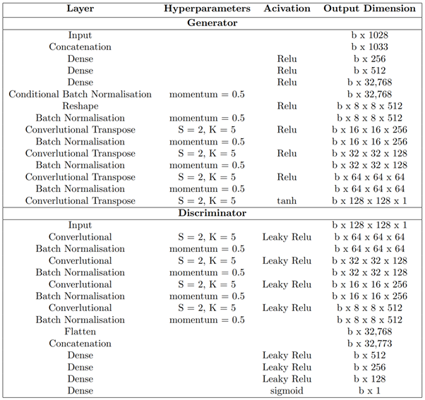
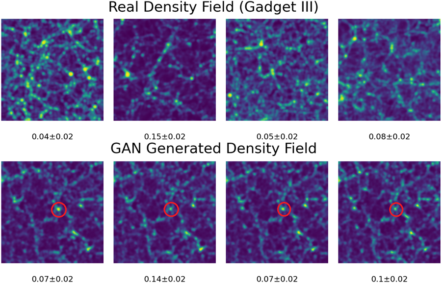
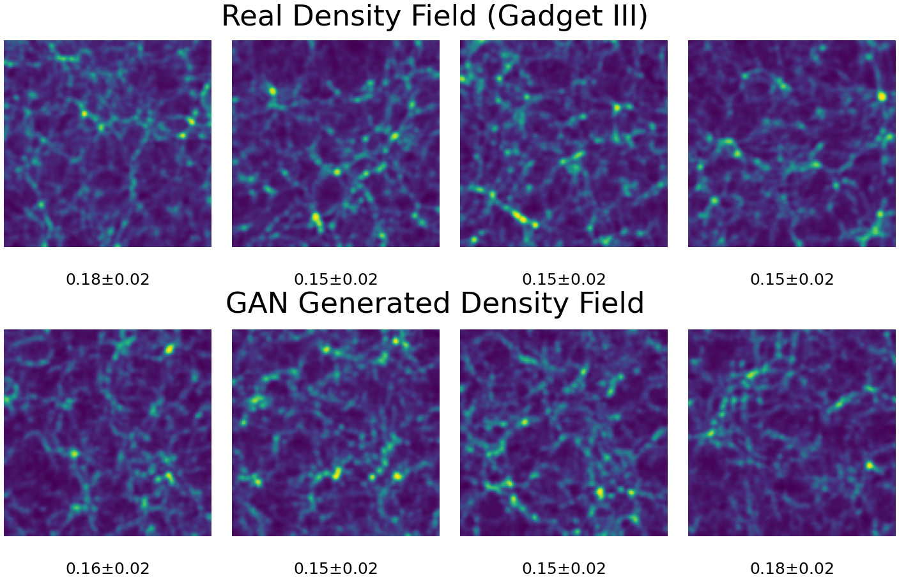

# SkyGAN

This repo provides base code for anyone looking to create continuous conditional-GAN generated 2D density fields in place of 2LPT or GADGET-III/GADGET-IV simulations of the universe. 

This version provides basic functionality required to do this with a conditional generative advisarial network. I will upload my more advanced version at a later date with more functionality and conditionalisation methods as well as a non-conditional GAN version. I also have versions that utilise a Wasserstein loss. Contact me if you want access to these before I have had a chance to upload them.

The generator and discriminator have the following structures.

Please reference the code if used in future work. Feel free to email me for more deatils, I have done many months’ worth of research in this area and can help with any inquiries or if you are stuck. 

I have more advanced GAN monitoring functions on the way including live summary statistics of the GAN generated density fields as well as WGANs to the same effect.

Some example outputs of this GAN include

The non-conditional version produced outputs that were visually indistinguishable from the dataset:

And the statistics of the resulting density fields were outstanding <2% error at the significant k modes. 

