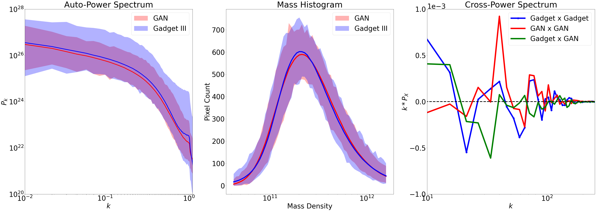

# SkyGAN

## About 
This repo provides base code for anyone looking to create continuous conditional-GAN generated 2D density fields in place of 2LPT or GADGET-III/GADGET-IV simulations of the universe. 

This version provides basic functionality required to do this with a conditional generative advisarial network. I will upload my more advanced versions at a later date (once I've tidied them up) with more functionality and conditionalisation methods as well as a non-conditional GAN version. I also have versions that utilise a Wasserstein loss. Contact me if you want access to these before I have had a chance to upload them.

## Dependencies
Tensorflow 
Numpy
Matplotlib

## Usage
The repo contains a test dataset of 1 batch of GADGET-III simulations from the quijote simulations. This is useful for debugging but is no where near enough to train an effective GAN. To get the full dataset see the Acknowlagements section. 
Clone the repo
Create new environment and install dependencies. If want GPU support download the NVIDIA CUDA package for you GPU(s).
Run the main.py 

To alter the model architecture see Models.py.
To alter the training procedure see train.py
To alter the GAN output durning training change the generate_and_save() function in train_monitor.py.

Note: at the time of this project Tensorflow contained a bug that effects the 2080 TI graphics card and others. This is fixed by a line that is commented out in line 
34 of main.py. 
## Model Structure 
The generator and discriminator have the following structures.

## Results 
Some example outputs of this GAN include

The non-conditional version produced outputs that were visually indistinguishable from the dataset:

And the statistics of the resulting density fields were outstanding <2% error at the significant k modes. 

## Yet to come

I have more advanced GAN monitoring functions on the way including live summary statistics of the GAN generated density fields as well as WGANs to the same effect.

## Contact
Please reference the code if used in future work. Feel free to contact me for more deatils, I have done many months' worth of research in this area and can help with inquiries or if you are stuck. 

## Acknowlagements

A big thankyou to the quijote simulations for prviding the dataset used in this project. If anyone is undertaking a project in computational cosmology then I 100% suggest that you chack out some of their datasets at https://quijote-simulations.readthedocs.io/en/latest/. If you need any help with automated downloads of the datasets then contact me. I have written python programs to that effect. I will try to upload non-sensitive (ips and endpoints) examples of these in the future. 

